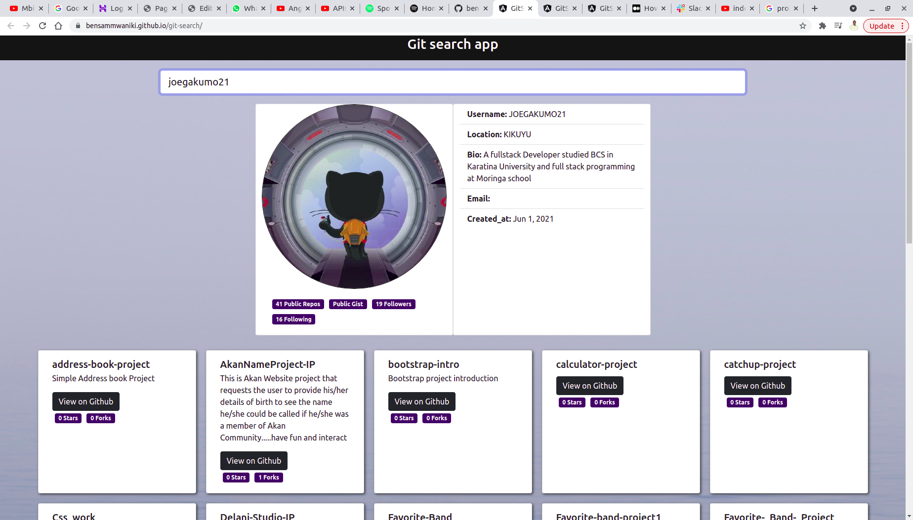

# GitSearch

This project was generated with [Git search](https://bensammwaniki.github.io/git-search/) version 11.2.14.

## project description
This is a website where users may enter a GitHub username into the search input, onkeyup.Enter, and see names and descriptions of that person's public repositories. you can be able to see users personal public data.A person can also look for repositories of that person. This project was generated with Angular CLI 11.2.14 version 

## set up and installatiion

The website is hosted at Git so incase you need a copy ensure you are in the right folder then type the following
git clone https://bensammwaniki.github.com/git-search/

## Technology Used

HTML

CSS

BOOTSTRAP

JAVASCRIPT

JQUERY

TYPESCRIPT

HTTPCLIENT

## Contacts details
email: bensonmwaniki@student.moringaschool.com

## Preview of the application
 